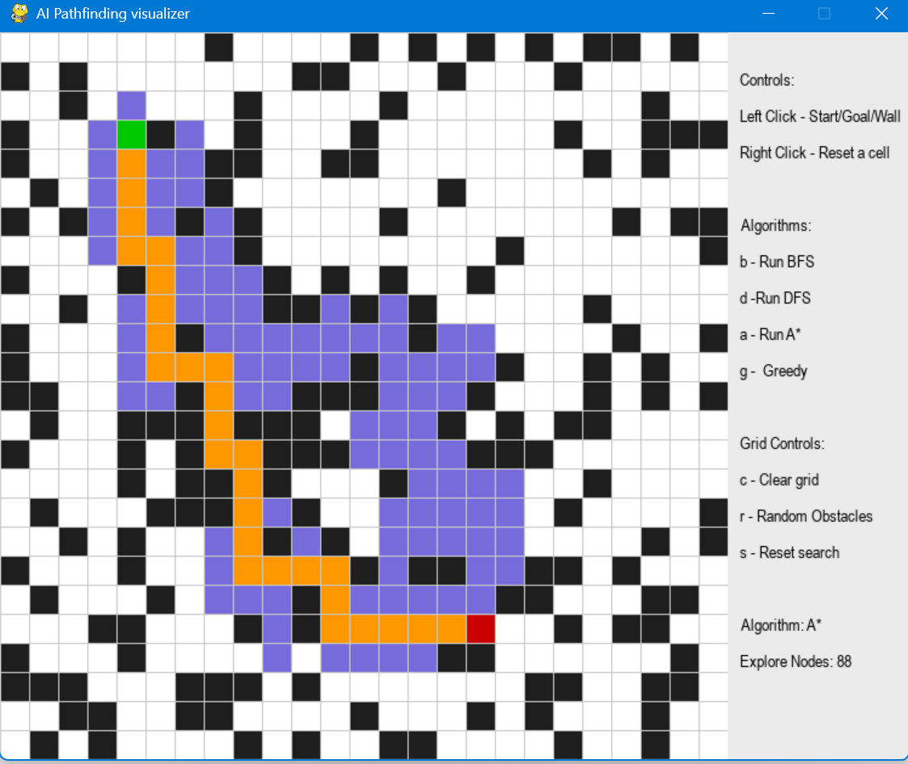

# AI Pathfinding Visualizer

An interactive Python + Pygame application that visualizes how classic AI search algorithms explore a grid to find a path between a start and a goal node. Built as part of an Artificial Intelligence course project to demonstrate and compare uninformed and informed search strategies.


---

## Overview

This project lets you draw a custom grid with walls, place a start and goal point, and then watch step by step how different AI search algorithms explore the grid to find a path. It's designed to make abstract search-algorithm concepts (BFS, DFS, A\*, Greedy Best-First Search) visually intuitive, and to compare their efficiency and path quality side by side.

---

## Demo



## Features

- **Interactive grid** — Left-click to place the Start node, Goal node, and Walls
- **Right-click to reset** any cell
- **Multiple search algorithms** implemented and run on the same grid for direct comparison
- **Real-time animated visualization** of node exploration and final path reconstruction
- **On-screen control legend** so all keybindings are visible at a glance
- **Instant grid reset** to quickly test different mazes

---

## Algorithms Implemented

| Algorithm | Key | Type | Shortest Path Guaranteed? |
|---|---|---|---|
| Breadth-First Search (BFS) | `B` | Uninformed | Yes (unweighted grid) |
| Depth-First Search (DFS) | `D` | Uninformed | No |
| A\* Search | `A` | Informed (heuristic+path cost) | Yes |
| Greedy Best-First Search | `G` | Informed (heuristic only) | No |

### How each one works

- **BFS** explores the grid layer by layer using a queue (FIFO), guaranteeing the shortest path on an unweighted grid.
- **DFS** explores as deep as possible along one path using a stack (LIFO) before backtracking it finds *a* path, but not necessarily the shortest one.

- **A* Search** uses both the actual cost from the start node (`g`) and a heuristic estimate to the goal (`h`). It selects nodes using `f = g + h` and, with an admissible heuristic such as Manhattan distance on this grid, guarantees the shortest path.
- **Greedy Best-First Search** uses only the heuristic (no accumulated cost) to decide which node to explore next — it's often faster than A\*, but does not guarantee the shortest path.

---

## Controls

| Action | Input |
|---|---|
| Set Start → Goal → Walls | Left Click |
| Reset a cell | Right Click |
| Run BFS | `B` |
| Run DFS | `D` |
| Run A\* | `A` |
| Run Greedy Best-First Search | `G` |
| Clear the entire grid | `C` |

---

## Project Structure

```
AI-Pathfinding-Visualizer/
│
├──assets/
│ └──pathfinding.demo.png
├── main.py             
├── bfs_algorithm.py         
├── dfs_algorithm.py             
├── a_star_algorithm.py     
├── greedy_algorithm.py       
├── .gitignore
└── README.md
```

---

## Getting Started


### Installation

```bash
# Clone the repository
git clone https://github.com/mdhimel126/AI-Pathfinding-Visualizer.git
cd AI-Pathfinding-Visualizer

# create a virtual environment

python -m venv venv

#On windos
venv\Scripts\activate       
#On linux
source venv/bin/activate    

# Install dependencies
pip install pygame
```

### Run

```bash
python main.py
```

---

## How to Use

1. Run `python main.py` — a grid window will open.
2. **Left-click** a cell to set the **Start** node (green).
3. **Left-click** another cell to set the **Goal** node (red).
4. **Left-click** additional cells to draw **Walls** (black).
5. Press a key (`B`, `D`, `A`, or `G`) to run that algorithm and watch it explore the grid in real time.
6. Press `C` to clear the grid and try a new maze.

---

## Author

**Md. Himel**
GitHub: [@mdhimel126](https://github.com/mdhimel126)

